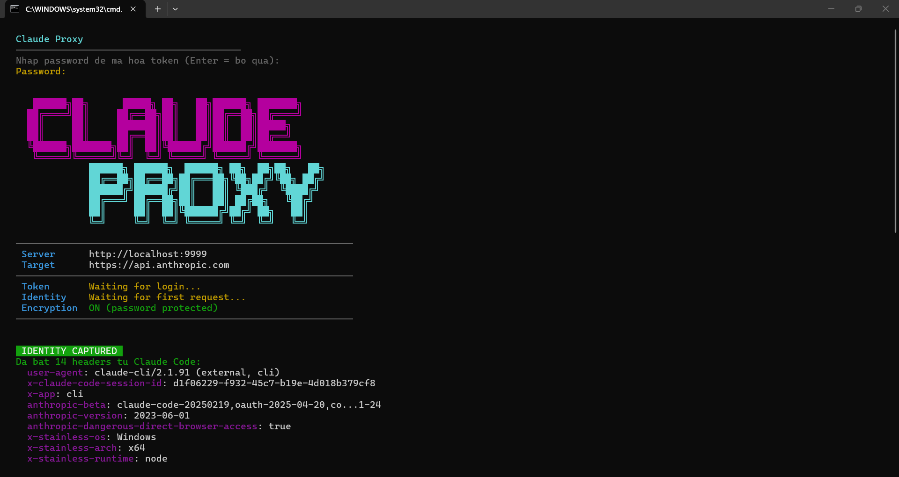

<div align="center">

# Claude Cloak

**Use Claude Code on multiple Windows devices — all appearing as a single machine to Anthropic.**

[](https://python.org)
[](https://docs.astral.sh/uv/)
[](https://fastapi.tiangolo.com)
[](LICENSE)

 

---

*Local transparent proxy that intercepts Claude Code API calls and makes all your devices appear as a single machine.*



</div>

## How It Works

Claude Cloak runs a local proxy on `127.0.0.1:9999`. Claude Code is auto-configured to send API requests through this proxy instead of directly to `api.anthropic.com`.

The proxy captures the device fingerprint (23 headers) from the first request, saves it to `.env`, and injects that same fingerprint into all subsequent requests — from any device. Combined with 7 other anonymity layers (telemetry blocking, body sanitization, IP stripping, etc.), Anthropic sees identical traffic from all your devices.

**Authorization is pass-through** — each device handles its own Claude Code login. The proxy only spoofs the device identity, not the auth token.

## Features

| Feature | Description |
|---------|-------------|
| **Auto-Capture** | Captures 23 device identity headers from first Claude Code request |
| **Header Locking** | All devices send identical fingerprint (user-agent, session-id, stainless-*, anthropic-*, sec-fetch-*, etc.) |
| **Telemetry Blocking** | Intercepts 13 telemetry/analytics URL patterns — returns fake `200 OK` |
| **Body Sanitization** | Strips 38 device-identifying fields + 10 nested objects from JSON request bodies |
| **IP Header Stripping** | Removes 15 IP-leaking headers (X-Forwarded-For, Via, CF-Connecting-IP, etc.) |
| **Cookie Isolation** | Strips outgoing `Cookie` + incoming `Set-Cookie` to prevent cross-device tracking |
| **Timing Jitter** | Random delay (10-150ms) per request to mask multi-device timing patterns |
| **Response Sanitization** | Strips 11 tracking headers from responses (Server-Timing, X-Trace-Id, NEL, etc.) |
| **Consistent IDs** | HMAC-SHA256 based IDs — all devices produce identical derived values |
| **Error Masking** | Internal errors never leak proxy details upstream |
| **Auto-Config** | Automatically sets `ANTHROPIC_BASE_URL` in Claude Code settings |
| **System Tray** | Optional Windows system tray app for background operation |
| **Coding Coach** | Privacy-safe "how you code" insights (tool mix, anti-patterns, reliability, cache/model fit, practice score) — counts only, no content stored |
| **Zero Config** | Just run `start.bat` — everything else is automatic |

## Quick Start

### First Device (one-time setup)

```bash
cd client
install.bat       # Installs uv (if missing) + syncs the locked dependencies
start.bat         # Start proxy + auto-config Claude Code
```

On macOS / Linux use `./start.sh`. To run it directly without the launcher:

```bash
uv run claude-cloak            # start the proxy
uv run claude-cloak-setup      # point Claude Code at it
```

Open Claude Code in VS Code and **log in normally**. The proxy captures the device fingerprint automatically and saves it to `.env`.

### Other Devices

```bash
cd client
install.bat       # Installs uv + syncs dependencies
```

Copy the **`.env` file** from the first device, then:

```bash
start.bat         # Start proxy + auto-config Claude Code
```

Log in to the same Claude Code account. The proxy replaces your device's fingerprint with the one captured from the first device.

## Security Layers

### Layer 1: Header Locking (23 headers)

All devices send identical fingerprints. Headers are captured from the first request and injected into all subsequent requests. If a client omits a captured header, the proxy adds it automatically.

| Header | Purpose |
|--------|---------|
| `user-agent` | Client version + OS |
| `x-claude-code-session-id` | Session identifier |
| `x-app` | Client type |
| `anthropic-beta` | Feature flags |
| `anthropic-version` | API version |
| `anthropic-dangerous-direct-browser-access` | Browser flag |
| `x-stainless-os` | Operating system |
| `x-stainless-arch` | CPU architecture |
| `x-stainless-runtime` | Runtime environment |
| `x-stainless-runtime-version` | Runtime version |
| `x-stainless-lang` | SDK language |
| `x-stainless-package-version` | SDK version |
| `x-stainless-retry-count` | Retry count |
| `x-stainless-read-timeout` | Read timeout |
| `accept-encoding` | Compression support |
| `accept-language` | Language preference |
| `sec-fetch-mode` | Fetch metadata |
| `sec-fetch-site` | Fetch site origin |
| `sec-fetch-dest` | Fetch destination |
| `origin` | Request origin |
| `referer` | Referrer URL |
| `x-client-version` | Client version |
| `x-client-name` | Client name |

Additionally, `x-request-id` is replaced with a fresh random hex per request to avoid leaking per-device identifiers.

The proxy also warns in the console when it encounters unknown headers not in its known list, so you can decide whether to add them to the capture list.

### Layer 2: Telemetry Blocking (13 patterns)

Intercepts requests matching known telemetry/analytics URL patterns and returns fake `200 OK` responses — Claude Code thinks the telemetry was sent, but nothing reaches Anthropic.

```
v1/telemetry, v1/analytics, v1/log, v1/events,
v1/diagnostics, v1/metrics, v1/track, v1/report,
telemetry, analytics, log_event, sentry, bugsnag
```

### Layer 3: Body Sanitization (38 fields + 10 objects)

Recursively scans JSON request bodies and replaces device-identifying string fields with HMAC-derived consistent fake values (so all devices produce the same replacement).

**Fields replaced (38 variants):**

```
machine_id, device_id, hostname, computer_name, username,
home_dir, os_version, os_release, platform_version, mac_address,
hardware_id, installation_id, instance_id, client_id,
workspace_id, vscode_machine_id, vscode_session_id
(+ camelCase and kebab-case variants of each)
```

**Nested objects emptied (10):**

```
system_info, device_info, machine_info, environment_info,
telemetry, diagnostics
(+ camelCase variants)
```

### Layer 4: IP Header Stripping (15 headers)

Removes headers that could leak the real client IP before forwarding to Anthropic:

```
X-Forwarded-For, X-Real-IP, X-Forwarded-Host, X-Forwarded-Proto,
X-Forwarded-Port, Forwarded, Via, X-Client-IP, CF-Connecting-IP,
True-Client-IP, X-Cluster-Client-IP, X-Originating-IP,
X-Remote-IP, X-Remote-Addr, Proxy-Connection
```

### Layer 5: Cookie Isolation

- Strips `Cookie` headers from outgoing requests
- Strips `Set-Cookie` headers from incoming responses
- Prevents any cookie-based device tracking across sessions

### Layer 6: Response Sanitization (11 tracking headers)

Strips tracking/correlation headers from upstream responses before returning to the client:

```
Server-Timing, X-Trace-Id, X-Span-Id, X-Request-Id,
X-Correlation-Id, X-Amzn-Trace-Id, X-Amzn-RequestId,
X-Ray-Trace-Id, NEL, Report-To, Reporting-Endpoints
```

### Layer 7: Timing Jitter

Adds a random async delay (default 10-150ms) to each request to prevent timing-based detection of multi-device usage. Configurable via `.env`:

```env
TIMING_JITTER=true
TIMING_JITTER_MIN_MS=10
TIMING_JITTER_MAX_MS=150
```

### Layer 8: Error Masking

All error responses return generic messages only — no internal proxy details, stack traces, or implementation info is ever leaked upstream. Error types handled:

- `504 Gateway timeout` — upstream timeout
- `502 Bad gateway` — connection failure
- `500 Internal proxy error` — all other errors

## Token Saver Mode (optional)

Set `TOKEN_SAVER=true` in `.env` to reduce input-token consumption on `/v1/messages`. Disabled by default — when OFF, request bodies pass through untouched.

### What it does

| Layer | Default | Description |
|-------|---------|-------------|
| **1h prompt cache** | ON | Bumps the existing prompt-cache TTL from 5m → 1h on the stable prefix (system block + last tool definition) and appends `extended-cache-ttl-2025-04-11` to `anthropic-beta`. Long Claude Code sessions hit cache far more often → input charged at the 0.1× cache-read rate instead of 1× fresh. |
| **Tool result truncation** | OFF | Walks `messages[]`, head+tail truncates `tool_result` blocks larger than `TOOL_RESULT_MAX_BYTES` in **older** turns (keeps the last `TOOL_RESULT_KEEP_RECENT` turns intact). |

### Safety guards

- **Breakpoint budget**: Anthropic allows at most 4 `cache_control` breakpoints per request. The proxy counts existing breakpoints and only modifies in-place — it never pushes the total above 4 (skips upgrading `system: string` when full).
- **Beta auto-fallback**: if Anthropic returns a 400 that mentions the cache-ttl beta, the proxy latches the beta off for the rest of the process and reverts to default 5m cache. No further failed requests.
- **Recent-turn protection**: tool_result truncation never touches the last `TOOL_RESULT_KEEP_RECENT` turns, preserving active agent context.

### Realistic impact

Input tokens drop ~15–35% on a typical Claude Code session; output is untouched. Since output is ~60–70% of total quota, **total quota reduction is around 8–18%** — useful for multi-device sharing and avoiding rate-limit throttle on Max plans, but not a silver bullet.

### Why tool truncation defaults OFF

Truncating an old `tool_result` is technically lossy: if Claude later needs to re-read that exact bash/read output, it'll have to re-run the command (which costs tokens). On x20 plans where you rarely hit limits, the saving is not worth the risk. Enable it when:
- Running multi-device share on the same quota
- Sessions routinely exceed 30 turns with large bash/read outputs
- You're regularly hitting "usage limit reached"

### Config

```env
TOKEN_SAVER=true
CACHE_EXTEND_TTL=true        # Bump cache TTL 5m → 1h on stable prefix
TOOL_RESULT_TRUNCATE=false   # Off by default; flip on for multi-device / long sessions
TOOL_RESULT_MAX_BYTES=8000   # Threshold to trigger truncation
TOOL_RESULT_HEAD_BYTES=4000  # Bytes kept from start
TOOL_RESULT_TAIL_BYTES=2000  # Bytes kept from end
TOOL_RESULT_KEEP_RECENT=2    # Recent turns left untouched
```

### Stats

`GET /health` returns live counters under `token_saver`:

```json
{
  "token_saver": {
    "enabled": true,
    "cache_extend_ttl_configured": true,
    "cache_extend_ttl_active": true,
    "tool_result_truncate": false,
    "tool_result_max_bytes": 8000,
    "requests_optimized": 42,
    "cache_breakpoints_added": 84,
    "cache_breakpoints_skipped_full": 0,
    "tool_results_truncated": 0,
    "bytes_saved": 312045,
    "tokens_saved_est": 78011,
    "beta_runtime_disabled": false
  }
}
```

`tokens_saved_est` is an approximation (`bytes_saved / 4`); use it as a directional metric, not an exact charge.

## Quota & Cost Tracking

Enabled by default (`QUOTA_TRACKING=true`). The proxy reads two things from every `/v1/messages` response:

1. **`anthropic-ratelimit-*` headers** → live remaining quota (requests, input tokens, output tokens, reset time)
2. **`usage` block** (from streaming SSE `message_start`/`message_delta` or non-streaming JSON) → input/output/cache token counts + computed USD cost

Bytes are never modified — the tap inspects, the proxy still streams the original chunks to the client. A 5 MB safety cap prevents runaway buffers.

### Endpoints

| Endpoint | Description |
|----------|-------------|
| `GET /quota` | Compact JSON — `cost_usd_total`, `tokens` (totals), `by_model` breakdown, `rate_limits` (remaining/limit/reset for requests + input + output tokens, plus retry-after) |
| `GET /health` | Full proxy status — includes a `quota` section with the same data |

Example `/quota`:

```json
{
  "cost_usd_total": 1.2345,
  "messages_requests": 42,
  "tokens": { "input_tokens": 12000, "output_tokens": 8400, "cache_creation_input_tokens": 3200, "cache_read_input_tokens": 87000 },
  "by_model": [
    {"model": "sonnet-4", "requests": 38, "input_tokens": 11000, "output_tokens": 7800, "cost_usd": 1.1024},
    {"model": "haiku-4",  "requests":  4, "input_tokens":  1000, "output_tokens":  600, "cost_usd": 0.1321}
  ],
  "by_session": [
    {"session_id": "abc123…f9e2", "requests": 24, "input_tokens": 7400, "output_tokens": 5100, "cost_usd": 0.6712,
     "models": {"sonnet-4": 22, "haiku-4": 2}, "first_seen": "2026-05-09T09:12:03", "last_seen": "2026-05-09T12:30:14"}
  ],
  "by_day": [
    {"date": "2026-05-09", "requests": 18, "input_tokens": 5200, "output_tokens": 3800, "cost_usd": 0.4912},
    {"date": "2026-05-08", "requests": 24, "input_tokens": 6800, "output_tokens": 4600, "cost_usd": 0.7433}
  ],
  "rate_limits": {
    "requests_remaining": "1450", "requests_limit": "2000", "requests_reset": "2026-05-09T12:34:56Z",
    "input_tokens_remaining": "780000", "output_tokens_remaining": "120000",
    "retry_after": null, "updated_at": "2026-05-09T12:30:14"
  }
}
```

### Pricing

Defaults are public Anthropic list prices (USD per million tokens). Override per-tier via env if Anthropic changes them or you want plan-specific rates:

```env
PRICING_SONNET_5_INPUT=3.00
PRICING_SONNET_5_OUTPUT=15.00
PRICING_SONNET_5_CACHE_WRITE_5M=3.75
PRICING_SONNET_5_CACHE_WRITE_1H=6.00
PRICING_SONNET_5_CACHE_READ=0.30
```

Current defaults, per million tokens (cache tiers follow Anthropic's standard multipliers on input: 5 m write ×1.25, 1 h write ×2, read ×0.1):

| Model key | Input | Output |
|---|---|---|
| `FABLE_5`, `MYTHOS_5` | $10.00 | $50.00 |
| `OPUS_5`, `OPUS_4_8`, `OPUS_4_7`, `OPUS_4_6`, `OPUS_4_5` | $5.00 | $25.00 |
| `OPUS_4_1`, `OPUS_4`, `OPUS_3` | $15.00 | $75.00 |
| `SONNET_5`, `SONNET_4_6`, `SONNET_4`, `SONNET_3_7`, `SONNET_3_5` | $3.00 | $15.00 |
| `HAIKU_4` | $1.00 | $5.00 |
| `HAIKU_3_5` | $0.80 | $4.00 |
| `HAIKU_3` | $0.25 | $1.25 |

Note the split inside the Opus 4 line: **Opus 4.5 and newer are $5/$25**, only Opus 4.0/4.1 kept the older $15/$75 rate. A single `OPUS_4` key covering all of them over-reports 4.6/4.7/4.8 spend by 3×.

A model id matching no key is costed at `PRICING_FALLBACK_INPUT` / `PRICING_FALLBACK_OUTPUT` (Opus tier by default) rather than $0, so a model released after your build still shows up in the total. Those ids are listed under `unpriced_models` in `/quota` — treat their cost as an estimate and add a real key when you see one.

Cost calc uses the per-TTL breakdown when Anthropic provides it (`cache_creation.ephemeral_5m_input_tokens` / `ephemeral_1h_input_tokens`); falls back to the 5 m rate when only the legacy aggregate field is present.

### Stream health (diagnosing "Response stalled mid-stream")

When Claude Code reports a stalled response, it means no bytes reached it for a while — the proxy tracks why, in the **Stream health** section of `/dashboard` and the `stream` block of `/health` and `/quota`:

| Signal | What it points at | Fix |
|---|---|---|
| `stalls` > 0 | Upstream connection went silent; the proxy closed the stream and sent the client a proper SSE `error` event instead of hanging | Usually transient. `UPSTREAM_STALL_SECONDS` (default 120 s) sets the patience. |
| `pool_waits` > 0 with high `pool_wait_ms_avg` | Requests are queueing for a free upstream connection — the classic silent stall on a shared proxy | Raise `UPSTREAM_MAX_CONNECTIONS` (default 100) |
| `connect_retries` > 0 | Dead pooled connections that were retried before any byte was forwarded — recovered, not user-visible | Nothing, unless it climbs steadily |
| `client_disconnects` | The client hung up mid-stream (closed tab, cancelled turn) | Benign |
| `ttfb_ms_avg` / `ttfb_ms_max` | Time to first byte through the proxy | High values with no pool waits point upstream |

Telemetry shipping (Loki) uses its own connection pool, so a slow log push can never take a connection slot away from an API request.

### What it's good for

- **Multi-device share**: one dashboard for total spend across all devices using the proxy
- **Avoid surprise rate-limits**: see remaining quota before hitting 429
- **Token-saver verification**: compare `cache_read_input_tokens` (cheap) vs `input_tokens` (full price) to confirm cache hit rate
- **Cost attribution**: `by_model` shows where the spend lands

### Web Dashboard

Open `http://localhost:9999/dashboard` for a live web UI:

- **Totals** card grid — total cost, requests, distinct sessions, paid input / output / cache read / cache write
- **Stream health** cards — stalled streams, time-to-first-byte (avg/peak), connection-pool waits, connect retries, client disconnects
- **Live rate-limit progress bars** color-coded green / amber / red with reset times
- **Daily trend chart** — last 15 days, cost line + input/output token bars on dual y-axes
- **Cost-by-model doughnut** — lifetime breakdown
- **Daily breakdown table** — date · requests · tokens · cost
- **Per-model breakdown table**
- **Per-session breakdown table** — each device's `x-claude-code-session-id` shown separately (the proxy locks identity outbound, but tracks each session inbound)
- Auto-refreshes every 5 s, polls `/quota`. Sticky header with live status pill. Chart.js loaded from CDN; the rest is self-contained vanilla JS that degrades gracefully if blocked

### Per-Session & Daily Tracking

The proxy reads `x-claude-code-session-id` from each **incoming** request (before the proxy rewrites it to the locked identity) and groups stats per session. So even though every device sends the same locked session-id outbound, the dashboard shows each device's own session distinctly.

Daily buckets use **local time** (`datetime.now()`). The dashboard shows the most recent 15 days; the proxy keeps up to `QUOTA_MAX_DAYS` (default 30) on disk.

| Cap | Default | Behavior when exceeded |
|---|---|---|
| `QUOTA_MAX_SESSIONS` | 100 | Oldest session (by `last_seen`) evicted |
| `QUOTA_MAX_DAYS`     | 30  | Oldest date evicted |

### Persistence

Counters are persisted to `.quota.json` next to `.env` so totals survive proxy restarts. Writes are debounced — at most every `QUOTA_PERSIST_INTERVAL` seconds (default 30) plus a forced flush on shutdown. The file is git-ignored. Schema v1 files are migrated forward automatically (by_session / by_day start empty).

```env
QUOTA_PERSIST_INTERVAL=30      # Write at most every N seconds
QUOTA_MAX_SESSIONS=100         # Cap on per-session buckets
QUOTA_MAX_DAYS=30              # Cap on per-day buckets
# QUOTA_PERSIST_PATH=          # Override location (default: .quota.json next to .env)
```

`rate_limits` are NOT persisted — those values would be stale by next process start. Reset all stats by deleting `.quota.json`.

### Auto Monthly Reset

Set `QUOTA_MONTHLY_RESET=true` (default) to automatically clear `cost_usd_total`, `usage_total`, `by_model`, and `by_session` at the start of each calendar month. `by_day` history is preserved so the trend chart spans multiple months. The dashboard topbar shows a `YYYY-MM · resets in Nd` pill so you can see when the next reset happens.

## Config Console (`/config`)

Every knob lives in `.env`, which is invisible unless you can SSH to the box. `/config` puts them on a screen — read-only by default, editable once you authenticate.

```env
ADMIN_TOKEN=$(openssl rand -hex 32)   # enables editing; without it the console is read-only
ADMIN_SESSION_HOURS=12
ADMIN_MAX_FAILED=5
ADMIN_LOCKOUT_SECONDS=300
```

### Two gates, not one

`ADMIN_IPS` (which already guards `/admin/*`) decides **where** a request may come from. It does not prove **who** sent it, so it is not enough on its own for a screen that can change behaviour. `/config` adds a second gate:

1. **Network** — the request IP must be in `ADMIN_IPS` (default: loopback only). Non-admin IPs get `403` before a login is even possible.
2. **Identity** — editing requires `ADMIN_TOKEN`, exchanged for a short-lived cookie signed with HMAC-SHA256 over `SESSION_SECRET`. The cookie is `HttpOnly` (XSS can't read it) and `SameSite=Strict` (no cross-site request can ride it). Tokens are compared in constant time, and an IP is locked out after `ADMIN_MAX_FAILED` bad attempts.

With no `ADMIN_TOKEN` set, the console still renders — but every write is refused, so an unconfigured deployment can't be mutated remotely.

### Three scopes, by blast radius

| Badge | Meaning | Examples |
|---|---|---|
| `live` | Applied to the running proxy immediately, no restart | `UPSTREAM_STALL_SECONDS`, `TIMING_JITTER`, `TOKEN_SAVER`, quota caps |
| `restart` | Saved to `.env`, takes effect next start — and says so instead of pretending | `UPSTREAM_MAX_CONNECTIONS` and the other pool settings (the HTTP client is built once at startup) |
| `locked` | Never writable from the web, at any privilege level | `ADMIN_IPS`, `ALLOWED_IPS`, `ADMIN_TOKEN`, `SESSION_SECRET`, `DEPLOY_MODE`, `LOCAL_PORT` |

The locked set is the important design decision: those settings decide **who may authenticate**. Leaving them web-editable would let a single leaked token whitelist an attacker's own IP and rewrite the admin password — turning temporary access into permanent access. They stay editable only by someone who can already reach the host.

Secret-valued settings (`ADMIN_TOKEN`, `SESSION_SECRET`, `LOKI_URL`, `LOKI_USER_EMAIL`) report **presence only** — the value never leaves the process, not even to an authenticated admin.

Values are validated before they are written (type, range, allowed choices), so a typo is rejected with a reason rather than silently breaking the proxy. Model pricing is displayed but intentionally read-only: a mistyped rate silently corrupts every cost figure that follows it.

> **Note:** `SESSION_SECRET` is auto-generated at startup when it isn't in `.env`, which invalidates admin sessions on every restart. Pin it in `.env` if you want sign-ins to survive restarts.

## Coding Coach (optional, on by default)

Because every Claude Code request already flows through the proxy, it's the perfect vantage point to derive **coaching insights about *how* you code** — not just how much you spend. Inspired by tools like Microsoft's *AI Engineering Coach*, but rebuilt to fit this project's anonymity ethos.

**Privacy by design** — the coach **counts only**. It never reads, stores, or transmits prompt text, code, or file paths, and it makes **no extra API calls** (no LLM grading of prompts). Prompt-content evaluation was deliberately left out: doing it well needs either reading sensitive content or spending tokens, and a heuristic on prompt text misses too many cases.

### What it measures

| Dimension | Signal | Source (already proxied) |
|-----------|--------|--------------------------|
| **Tool usage** | Count of each `tool_use` the assistant emits (Read, Edit, Bash, Grep, …) | Response stream |
| **Read/edit discipline** | Reads vs. edits — editing far more than reading is an anti-pattern | `tool_use` counts |
| **Tool reliability** | Share of `tool_result` blocks flagged `is_error` | Request bodies (last turn only) |
| **Cache efficiency** | Cache hit rate `cache_read / (input + cache_read)` | Existing usage totals |
| **Session depth** | Avg turns per distinct session | Existing per-session stats |
| **Cadence** | Assistant turns by hour of day (local) | Response timing |
| **Model fit** | Share of spend on the priciest Opus tier | Existing per-model stats |

These roll up into a **practice score (0–100)** — a weighted blend of discipline, reliability, and cache efficiency — plus a list of **actionable tips** (e.g. *"50% tool calls failed — check paths before running"*, *"90% of cost is on Opus — consider Sonnet/Haiku for simple work"*).

### Where to see it

- **Dashboard**: a new **Coaching** section in `http://localhost:9999/dashboard` (score + metric cards, tool-usage bars, tips, activity-by-hour).
- **JSON**: `GET /coach` returns the full computed view.

### Config & persistence

```bash
COACH_ENABLED=true            # set false to disable entirely
# COACH_PERSIST_PATH=         # default: .coach.json next to .env
```

Counters persist to `.coach.json` (gitignored), debounced on the same interval as quota stats and force-flushed on shutdown.

## Loki Log Shipping (optional)

The proxy can forward structured events to a [Grafana Loki](https://grafana.com/oss/loki/) push endpoint, so you can visualise multi-device cost/usage in Grafana alongside whatever else you observe.

Enable by setting `LOKI_URL` in `.env`:

```env
LOKI_URL=http://192.168.15.120:3100/loki/api/v1/push
LOKI_JOB=claude-cloak           # default
LOKI_HOST=                      # default: socket.gethostname()
LOKI_USER_EMAIL=                # optional, becomes a Loki label if set
LOKI_LABELS=team=eng,env=dev    # optional extra static labels
LOKI_BATCH_SIZE=100
LOKI_FLUSH_INTERVAL=5
LOKI_MAX_BUFFER=2000
```

Events emitted (low-cardinality labels + JSON fields):

| `event` | When | Key fields |
|---|---|---|
| `usage`    | After each successful `/v1/messages` | `conversation_id`, `input_tokens`, `output_tokens`, `cache_read_tokens`, `cache_creation_tokens`, `estimated_tokens`, `cost_usd`, `duration_ms`, label `model` |
| `error`    | Non-2xx responses or transport errors  | `status`, `path`, `method`, `error_type` (`unauthorized`/`rate_limit`/`client_error`/`server_error`/`timeout`/`connect_error`/`proxy_error`), `duration_ms`, `retry_after`, `conversation_id` |
| `blocked`  | Telemetry endpoint intercepted         | `path`, `method` |
| `identity` | Identity headers captured first time   | `headers_count`, `headers` (list of header names — never values) |

Standard labels: `job`, `host`, `event`, plus `model` on `usage`/`error`. Buffering is bounded (default 2000 events); flush failures warn at most once per minute and never block requests. If Loki goes down or `LOKI_URL` is unreachable, the proxy keeps running normally.

### Bundled Grafana dashboard

Import `client/grafana-dashboard.json` into Grafana (Dashboards → New → Import). It includes:

- **Overview** — total cost, requests, total tokens, avg cost/request, active sessions, active hosts
- **Cost & Volume Trends** — stacked cost over time by model, token throughput (input/output/cache), requests/min by host, latency (p50/p95/max)
- **Breakdown** — cost by model (donut), cost by host (donut), top 10 sessions by cost
- **Cache & Efficiency** — cache hit rate, input/output/cache_read/cache_creation token totals
- **Errors & Telemetry Blocking** — error rate, 429/401/5xx counts, telemetry blocked, identity captures, errors over time, top blocked paths
- **Raw Events** (collapsed) — full log stream

The dashboard expects the `Loki` datasource to exist in Grafana; rename via the import dialog if yours has a different name.

### Caveats

- Cost numbers are **estimates** based on the configured pricing table; the canonical source remains the Anthropic console.
- Requests served from the telemetry-block layer never touch Anthropic, so they're not counted.
- The dashboard loads Chart.js from `cdn.jsdelivr.net`. If you're air-gapped or block third-party CDNs, the cards / table / progress bars still render — only the two charts will be blank.

## Server Mode (shared VM)

Instead of running one proxy per device, deploy a single proxy on a VM and point every client at it. Identity-spoofing + token-saving + quota tracking all keep working; access is gated by source-IP whitelist and (optionally) per-user spend caps.

### Why server mode

- One `.env` to maintain (the VM's). New devices just point `ANTHROPIC_BASE_URL` at the VM — no need to copy the captured fingerprint around.
- Centralised dashboard + per-user cost cap.
- Same anonymity layers as local mode — only the deployment topology changes.

### VM-side setup

1. Open the proxy's port on the VM firewall / cloud security group (default 9999).
2. Run the launcher for your VM's OS:
   ```bash
   cd client
   ./start-server.sh                 # macOS / Linux
   start-server.bat                  # Windows
   ./start-server.sh --reconfigure   # re-run the wizard to change settings
   ```
3. **First run only** — the launcher prompts interactively for:
   - `ALLOWED_IPS` (required) — comma-separated IPs / CIDRs that may use the proxy
   - `IP_LABELS` (optional) — `<ip>:<label>` map, used as a fallback when a client doesn't supply a `/u/<name>/` URL prefix
   - Per-user spend cap (optional) — period (monthly / daily), default cap, and per-label overrides
   - `CAPTURE_LOCK_FROM_IP` (optional) — restrict the first-request fingerprint capture to one specific source IP. Use this when you want a specific machine to provide the locked device identity, instead of "whoever happens to hit the proxy first"
   - `STATS_PRIVATE` (optional) — when on, gate `/health`, `/quota`, `/quota/users`, `/dashboard`, and `/coach` behind `STATS_VIEW_IPS` (defaults to loopback) so whitelisted users can't see each other's spending
   All get saved to `.env`. Re-runs skip the wizard unless `ALLOWED_IPS` is empty or you pass `--reconfigure`.
4. **First request from a whitelisted device** auto-captures that device's identity headers (user-agent, `x-stainless-*`, etc.) and locks them in `.env`. Every subsequent request — from any device — has those headers injected, so Anthropic sees one device.

> **Safety guard:** if `DEPLOY_MODE=server` and `ALLOWED_IPS` is empty, the proxy aborts at startup. Since identity auto-capture only fires from inside the access-control middleware, only whitelisted callers can ever set the fingerprint.

Want to bypass the wizard? Edit `.env` directly:

```env
DEPLOY_MODE=server
# LOCAL_HOST=0.0.0.0           # default in server mode
ALLOWED_IPS=203.0.113.5,198.51.100.0/24,2001:db8::/32
IP_LABELS=203.0.113.5:phong,198.51.100.7:huy
USER_QUOTA_ENABLED=true
USER_QUOTA_PERIOD=monthly      # monthly | daily
USER_QUOTA_DEFAULT_USD=20.0
USER_QUOTA_HARD_LIMIT=true     # 429 when over cap (false = warn only)
USER_QUOTA_CAPS=phong:50.0,huy:30.0
```

### Client-side setup

Each device points Claude Code at the VM with a **per-user URL prefix** so the dashboard can attribute every request to the right person. No local proxy is started on the client.

```bash
# Recommended — one-shot launcher
setup-remote.bat http://VM_IP:9999 phong         # Windows
./setup-remote.sh http://VM_IP:9999 phong        # macOS / Linux
# Run with no args to be prompted for both URL and username.

# Equivalent: call the Python script directly
uv run claude-cloak-setup --remote http://VM_IP:9999/u/phong

# Equivalent: per-shell env var (no settings.json change)
export ANTHROPIC_BASE_URL=http://VM_IP:9999/u/phong
claude
```

Claude Code then sends `/u/phong/v1/messages`. The VM strips the `/u/phong/` prefix, attributes the request to user `phong`, then forwards `/v1/messages` to Anthropic with the locked fingerprint.

#### Why the URL prefix beats IP-based attribution

A single source IP can be 20 people behind one office NAT, or one person whose 4G IP changes every hour. `IP_LABELS` is brittle in both cases. The `/u/<name>/` prefix means each user identifies themselves to the proxy — independent of network topology — so the dashboard / quota cap always lands on the right person.

Trust model: this is **identification, not authentication**. Anyone whose source IP is in `ALLOWED_IPS` can claim any username. That's fine inside a trusted team (`ALLOWED_IPS` is already the network-level gate); if you need cryptographic guarantees, layer a reverse proxy with mTLS in front.

Verify your client setup at any time:
```bash
curl http://VM_IP:9999/u/phong/whoami
# → { "label": "phong", "user_quota_enabled": true, "bucket": { "cap_usd": 50.0, "cost_usd": 12.34, ... } }
```

The original `start.bat` / `start.sh` workflow still works unchanged for anyone who wants the **local** per-device proxy instead — server mode is purely additive.

### Per-User Quota

When `USER_QUOTA_ENABLED=true`, every `/v1/*` request is attributed to the source IP, mapped to a label via `IP_LABELS` (unmapped IPs use the raw IP string). The proxy tracks USD cost per user and either soft-warns or hard-blocks once the cap is hit.

| Behaviour | `USER_QUOTA_HARD_LIMIT=true` (default) | `USER_QUOTA_HARD_LIMIT=false` |
|---|---|---|
| Over cap | Returns 429 with `Retry-After: <secs until period reset>` | Still proxies the request; only `blocked_count` increments |
| Tracking | Always on (visible in dashboard + `/quota/users`) | Always on |

Period rolls over automatically at the start of each `daily` / `monthly` boundary (local time). Cap overrides per-label live in `USER_QUOTA_CAPS`; unmapped users fall back to `USER_QUOTA_DEFAULT_USD` (set to `0` for unlimited).

### Endpoints (server mode additions)

| Endpoint | Description |
|----------|-------------|
| `GET /quota/users` | All users + cap usage |
| `GET /quota/users/{label}` | Detail for one user |
| `POST /admin/quota/reset/{label}` | Manually zero a user's counters. Caller must come from `ADMIN_IPS` (default loopback only) |

The dashboard at `/dashboard` auto-renders a **Per-User Quota** table when the feature is on, with colour-coded cap-usage badges (green / amber / red).

### Auto-start on Windows (survives reboot + crashes)

On a VM you usually want the proxy to come back up automatically after a Windows update / reboot, and to recover if `proxy.py` ever exits unexpectedly. Two one-shot scripts ship for this:

```cmd
:: First-time setup of the auto-start service (right-click → Run as administrator)
install-service.bat

:: Stop and remove the auto-start service (right-click → Run as administrator)
uninstall-service.bat
```

What `install-service.bat` does:

1. Verifies you already ran `start-server.bat` once (needs `.env` with `ALLOWED_IPS`)
2. Registers a Scheduled Task **`ClaudeCloakServer`**:
   - Trigger: **At system startup** — runs without anyone logged in
   - Account: **SYSTEM** — survives logoff and RDP disconnect
   - Action: launches `service-run.bat`, which loops `uv run claude-cloak` forever and restarts 5 s after any exit
3. Starts the task immediately so you don't need to reboot to test

After install:

| Command | What it does |
|---|---|
| `schtasks /query /tn ClaudeCloakServer` | Show task status |
| `schtasks /end /tn ClaudeCloakServer` | Stop the proxy now |
| `schtasks /run /tn ClaudeCloakServer` | Start the proxy now |
| `type service.log` | View proxy stdout / stderr |
| `powershell Get-Content service.log -Wait -Tail 50` | Live tail logs |

If `service.log` shows `'uv' is not recognized`, the SYSTEM account can't see uv: it installs per-user by default. `service-run.bat` already falls back to `%USERPROFILE%\.local\bin\uv.exe` and `%LOCALAPPDATA%\Programs\uv\uv.exe` — if uv lives somewhere else, either add that directory to the *system* PATH or edit `UVBIN` at the top of `service-run.bat`.

### Security notes

- The whitelist matches the raw TCP source (`request.client.host`), not any `X-Forwarded-For` header — there's no reverse proxy in this setup, so spoofing isn't possible.
- All identity sanitization layers still apply, so even though many clients now share one VM, Anthropic still sees a single device.
- The `.env` on the VM contains the captured fingerprint + `SESSION_SECRET`. Treat it like a credential — anyone who reads it can impersonate that device pool. Same goes for `.quota.json` if you care about hiding spend history.
- Defence in depth: pair `ALLOWED_IPS` with an OS firewall rule (ufw / iptables / cloud security group) for the same CIDR. If a code bug ever opens up the app-level whitelist, the firewall still holds.
- **Stats visibility**: by default any whitelisted client can `GET /quota` or open `/dashboard` and see the whole team's spend, including per-user breakdowns. Set `STATS_PRIVATE=true` (and optionally `STATS_VIEW_IPS`) to restrict those endpoints. `/u/<label>/whoami` stays open so each client can still self-check.
- **First-capture race**: whoever sends the first `/v1/messages` after a fresh boot locks the device fingerprint for the whole pool. If you care which machine that is, set `CAPTURE_LOCK_FROM_IP` to that machine's source IP — every other request that arrives before will be allowed through but won't trigger capture.
- **Trust model for `/u/<label>/`**: the URL prefix is *identification*, not *authentication*. Any whitelisted user can claim any username. Inside a trusted team that's fine (the IP whitelist is the actual gate); if you need cryptographic guarantees, put nginx + mTLS in front.

## What It Does NOT Do

| | Description |
|---|---|
| ❌ No token capture | `Authorization` header is passed through from each request — the proxy does not store or inject auth tokens |
| ❌ No encryption | Identity data in `.env` is stored in plaintext — protect the file yourself |
| ❌ No account sharing | Each device must log in to Claude Code independently — the proxy only unifies the device fingerprint |
| ❌ No internet exposure | Proxy binds to `127.0.0.1` only — never accessible from the network |

## Project Structure

```
client/
├── proxy.py               # Shim → claude_cloak.cli (keeps `python proxy.py` and old shortcuts working)
├── setup_claude.py        # Shim → claude_cloak.setup_claude
├── tray_app.py            # Shim → claude_cloak.tray_app
├── start.bat              # Windows: LOCAL mode (per-device proxy on 127.0.0.1)
├── start.sh               # macOS / Linux: LOCAL mode (per-device proxy)
├── start-server.bat       # Windows: SERVER mode (shared VM, IP whitelist + wizard)
├── start-server.sh        # macOS / Linux: SERVER mode (shared VM)
├── setup-remote.bat       # Windows client: point Claude Code at VM with /u/<username>
├── setup-remote.sh        # macOS / Linux client: same
├── service-run.bat        # Windows: restart-loop wrapper invoked by Task Scheduler
├── install-service.bat    # Windows: register auto-start service (run as Administrator)
├── uninstall-service.bat  # Windows: remove the auto-start service
├── install.bat            # Windows dependency installer
├── grafana-dashboard.json # Importable Grafana dashboard for Loki-shipped events
├── .env.example           # Config template with all captured header fields
├── .env                   # Captured identity + config (git-ignored)
└── .quota.json            # Persisted quota/cost counters (git-ignored, auto-managed)
```

The proxy itself is a package:

```
pyproject.toml             # uv project: deps, entry points, ruff/ty/pytest config
uv.lock                    # pinned, reproducible dependency set
src/claude_cloak/
├── cli.py  app.py         # entry point; FastAPI factory + lifespan
├── settings.py            # every operator-tunable value, read from .env
├── state.py               # all mutable runtime state (no module globals)
├── env.py                 # .env discovery, typed readers, save_to_env
├── terminal.py constants.py
├── access.py identity.py sanitize.py tokens.py pricing.py
├── coach.py loki.py upstream.py middleware.py admin.py config_console.py
├── echo.py                # DEV_ECHO_MODE synthetic upstream
├── banner.py
├── quota/                 # persist.py usage.py users.py tap.py
├── routes/                # health quota coach config admin pages passthrough
└── web/                   # dashboard.html, config.html
tests/                     # pytest suite + golden endpoint snapshots
```

## Endpoints

| Endpoint | Description |
|----------|-------------|
| `GET /health` | Returns proxy status: identity captured, headers locked, telemetry blocked count, bodies sanitized count, unknown headers seen, full quota/cost stats |
| `GET /quota` | Compact quota + cost summary (see Quota & Cost Tracking section) |
| `GET /quota/users` | All per-user buckets + cap usage (server mode) |
| `GET /quota/users/{label}` | Detail for one user |
| `GET /u/{label}/whoami` | Client self-check: confirms IP is whitelisted + label is parsed + cap is what the operator set |
| `POST /admin/quota/reset/{label}` | Reset a user's counters (loopback / `ADMIN_IPS` only) |
| `* /u/{label}/{path}` | Same as `* /{path}` but accounts the request to `<label>` regardless of source IP |
| `GET /dashboard` | Web UI rendering `/quota` as charts (Chart.js, dark theme, auto-refresh 5s) + Coaching section |
| `GET /coach` | Privacy-safe coaching insights JSON (see Coding Coach section) |
| `GET /config` | Config console — `ADMIN_IPS` only; read-only until you sign in with `ADMIN_TOKEN` |
| `GET /config/data` | Current settings as JSON, with scope and validation metadata. Secrets report presence only |
| `POST /config/login` | Exchange `ADMIN_TOKEN` for a signed session cookie (rate-limited per IP) |
| `POST /config/logout` | Drop the session cookie |
| `POST /config/apply` | Write a batch of settings — requires a session; returns applied / rejected / restart-required |
| `* /{path}` | Proxy catch-all — applies all 8 layers then forwards to `api.anthropic.com/{path}` |

## Requirements

- **[uv](https://docs.astral.sh/uv/)** — the launcher scripts install it automatically if missing
- **Python** 3.11+ (uv provisions it for you if the system Python is older)
- **Windows** 10/11, macOS or Linux
- **Claude Code** (VS Code extension or CLI)

Dependencies are pinned in `uv.lock`; `uv sync` reproduces the exact environment.
There is no `requirements.txt` and no `pip` step any more.

## Development

```bash
uv sync                  # create/refresh the environment from uv.lock
uv run pytest            # test suite
uv run ruff check src tests && uv run ruff format src tests
uv run ty check src      # type check
```

### Offline echo mode

`DEV_ECHO_MODE=true` makes the proxy answer `/v1/*` itself with a synthetic
Anthropic-shaped response (SSE when the request streams) instead of calling any
upstream. Identity locking, body sanitization, the token saver, quota/cost
recording and the coach all still run, so the whole pipeline is exercisable with
no API key, no network and no spend.

```bash
DEV_ECHO_MODE=true uv run claude-cloak
curl -s localhost:9999/v1/messages -H 'content-type: application/json' \
  -d '{"model":"claude-opus-5","messages":[{"role":"user","content":"hi"}]}'
curl -s localhost:9999/quota        # cost/token counters moved
```

To forward to a different upstream instead (a local echo server, a corporate
gateway), set `ANTHROPIC_UPSTREAM_URL`. Never enable `DEV_ECHO_MODE` in
production — no request reaches Anthropic.

### Configuration

Everything is read from `.env` — there are no tunable literals left in the code.
`client/.env.example` documents every key, including an **Advanced** section for
values that were previously hardcoded (cache beta id, buffer caps, retry
backoff, cookie name, …). Static tables (telemetry paths, sanitized body fields,
header policies, coach tool names) take `<NAME>_EXTRA` to append entries or
`<NAME>_OVERRIDE` to replace them, so no table needs a code change either.

## Troubleshooting

| Problem | Solution |
|---------|----------|
| `uv: command not found` after install | Open a new shell, or add `~/.local/bin` (Windows: `%USERPROFILE%\.local\bin`) to PATH |
| Port 9999 already in use | `start.bat` auto-kills old process. Or change `LOCAL_PORT` in `.env` |
| 401 Unauthorized | Your Claude Code auth token expired. Re-login in Claude Code on that device |
| 429 Rate Limited | Too many requests — wait and retry. The proxy logs this in the console |
| Unknown header warning | Proxy detected a new header not in its known list. Check console and decide if it should be captured |
| Timing jitter too slow | Reduce `TIMING_JITTER_MAX_MS` in `.env` or set `TIMING_JITTER=false` |
| Empty response from API | Check proxy console for error status codes |

---

<div align="center">
<sub>Local reverse proxy for consistent device fingerprinting across Claude Code instances on Windows.</sub>
</div>
